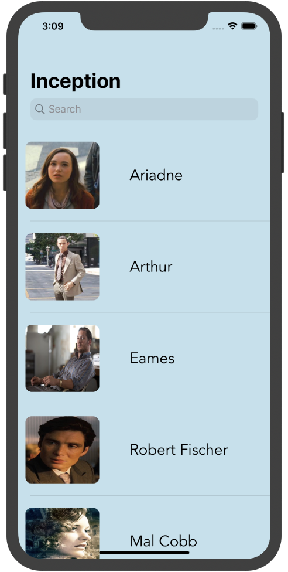
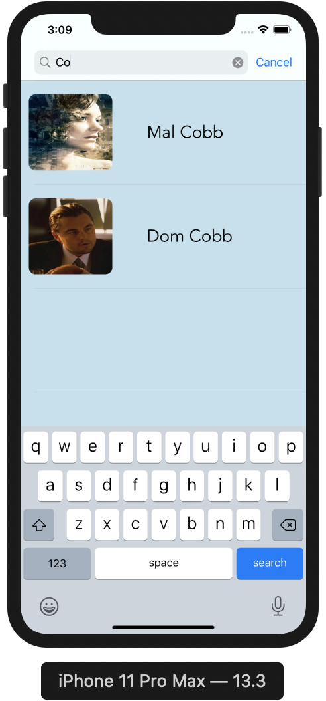
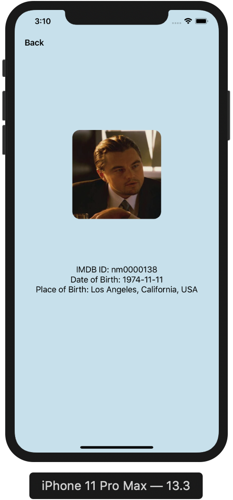

## cinema-cast

iOS app designed 100% programmatically(no Storyboard, SwiftUI or .xib files) to display information for the cast of a movie. Data is retrieved via a GET request to the movieDB API and then populates the appropriate ViewController with that information. 

API provider: https://developers.themoviedb.org/3 

  

  

  

